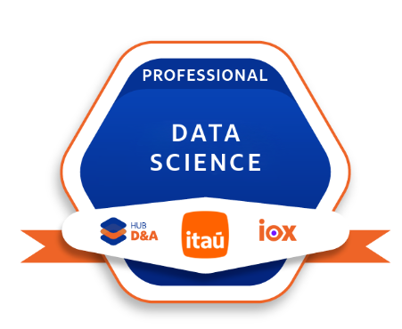
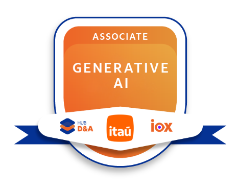

# Hi there! I'm José Murillo 👋

I am a **Data Scientist** currently working at [@Itaú-Unibanco](https://github.com/itau), with a focus on **data analysis**, **machine learning**, and **generative AI**.

---

## About me
- Learning about **Generative AI** and **multi-agent systems**
- **B.Sc. in Science and Technology** – Federal University of ABC [@UFABC](https://github.com/ufabc-bcc)    
- **B.Sc. in Computer Science** – Federal University of ABC [@UFABC](https://github.com/ufabc-bcc)
- Runner, nature lover, and outdoor sports enthusiast 🏊‍♂️🏃⚽

---

## 🛠️ Tools

---

## 📜 Certifications

  
  &nbsp;&nbsp;&nbsp;
  

---

## 📫 Contact
- 💼 LinkedIn: https://linkedin.com/in/josemurillolima  
- ✉️ Email: zemurillo@hotmail.com
